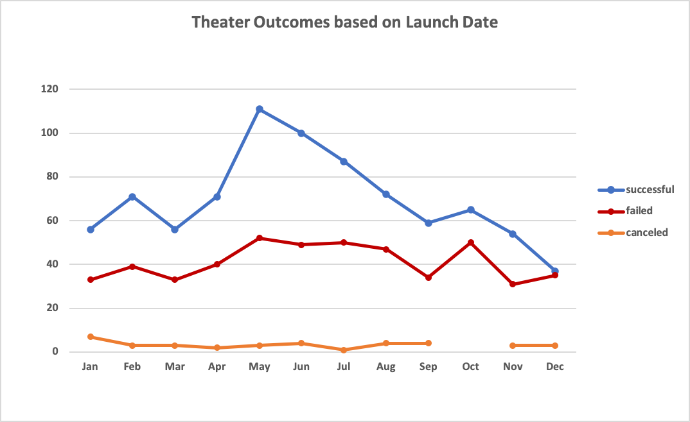
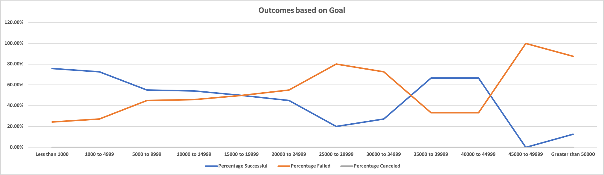

# **Kickstarter-analysis**
- Analysis of crowdfunded performing art campaigns "Kickstarter dataset" to uncover trends related to "Launch Dates" and "Funding Goals".
---
## Purpose
    - Louise, an upcoming playwright, is planning for her new play "Fever". She  planned to run a crowdfunding campaign to fund her play. She has reached the state where she is close to her fundraising goal. Now, she is confidently moving forward on further steps at the same time relying on the data analysis before each step. Before she gets into the production phase of the play, she wants to understand the trends of outcomes based on launch dates and funding goals of different campaigns. 

    - The same Kickstarter dataset - used for analysis before the fundraising, is being used now to visualize the different campaign outcomes based on the "Launch Dates" and "Funding Goals".

## **Analysis and Challenges**
    - The Kickstarter dataset comprises of the data having various forms of performing arts like Theater, Music, Technology, Film/Video etc., to name a few. Theater category deals with the performing art "Play" for whose success the data is being analysed. 
    
    - The Kickstarter dataset has data on outcomes of various campaigns.  It captures data on time period parameters of "Date created" and "Date ended". It even captures the demographic information indicating the country the campaigns were run. 

    -The dataset captures the data on funding goals set and achieved. It also gives insights on the number of supporters each campaign could attract.

    - The main challenge in the Kickstarter dataset was around the time period data. The dataset provided the UNIX timestamps which had to be converted to the readable format of 'Date created' and 'Date ended'. Microsoft Excel formula was applied to accomplish this task. Apart from this couple of new columns were required like Average Donation, Percentage Funded, Parent category and Subcategory for which the data were populated using other existing data columns.

    - The complete analysis of the dataset can be downloaded and viewed in the MS excel file hyperlinked as "Kickstarter-Analysis file" below : 
<a href="https://github.com/VinuthaBS/Kickstarter-analysis/blob/main/Kickstarter_Challenge.xlsx.zip">------> Kickstarter-Analysis file</a>

---
### Analysis of **Outcomes Based on Launch Date :**

- Following are the observations of Outcomes based on Launch Date presented as line chart below :

    - The success rate is the highest starting in the month of May for "Theater arts" which consists mainly of "Plays".
    - The best success rate trend starts from the month of May and keeps up the performance even in the month of June and starts declining slowly to July.
    - This satisfactory performance observed for the months of May and June can be observed in 3 consecutive years of 2014, 2015 and 2016 (Data can be filtered on Year in the associated pivot table of Kickstarter-Analysis file)  

</img>

### Analysis of **Outcomes Based on Goals :**

- Following are the observation of Outcome based on Goals line chart pasted below :

    - Best success rate of around 70-80% can be achieved when the funding goals are kept to the minimum.
    - Campaigns with high funding goals, results in increased failure percentage. 

</img>

### Challenges and Difficulties encountered :

    - Difficulty encountered during this process was around sharing the report on github repository. Unwanted file ".DS_Store" got added into the repository. Researched online on this and handled this issue using a ".gitignore" file.

## **Results :**

- Conclusions from Outcomes based on Launch Date :

    1) Recommendation to Louise is to target her play "FEVER" definitely and confidently for the month of May
    2) Louise should avoid not to time her play beyond July. She should make sure that her play is definitely not pushed to the end of the year, under any circumstances.

- Conclusion from Outcomes based on Goals :
    - As Louise is already close to her fundraising goals, she should just stick to the budget estimate and funding goals. Going by trends, by doing so, she can enjoy a good success rate.

- Limitations of the dataset :

    - The Kickstarter dataset provided most of the information required for the analysis in terms of time period, goals, demography. This set has the time period data between the years 2009 to 2017 with the data concentration majorly for 3 years 2014, 2015 and 2016. This seems to be a limitation that we are going by these 3yrs of data majorly. Dataset should have had data post 2016 to as much recent as possible which would have made our analysis more recent. 
    - For any performing arts, "publicity" plays an important role. It would have been great to have data around publicity which would have added one more parameter for the analysis.

- Tables and/or graphs that we could create :

    - Table / graph capturing reason for failure or success would have indicated "what not to do" and "what should be done surely" to achieve success.
    - Table / graph analysing more on the various demographies.
    - Table / graph analysing more on the likes of Edinburgh festival. 
